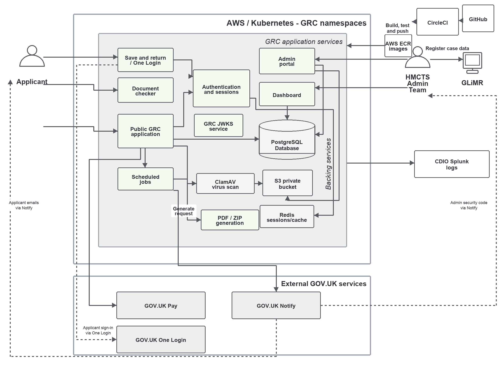

# Gender Recognition Certificate service
This is the code for the UK Government's Gender Recognition Certificate service.

The service is owned by the Gender Equalities Office (GEO) who have developed a public-facing application form to allow citizens to apply for a legally recognised certificate that acknowledges their acquired gender.

## Architecture: 

## I want to apply for a Gender Recognition Certificate
Please visit the Gov.UK website to [apply for a Gender Recognition Certificate](https://www.gov.uk/apply-gender-recognition-certificate)

## I am a software developer working on the Gender Recognition Certificate service code
Please see the [developer documentation](./documentation/README.md) for a description of how to run, deploy and backup the service.
